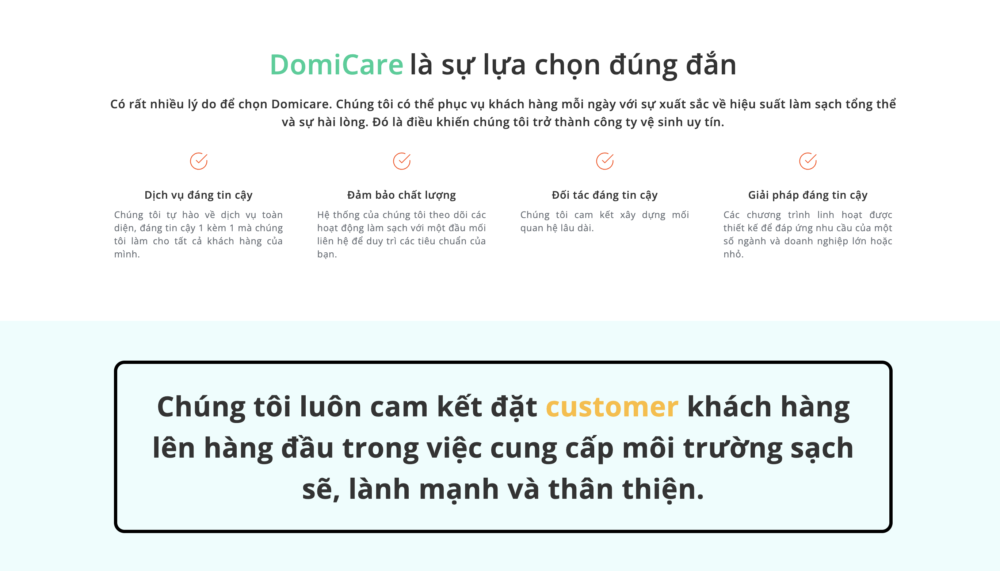

# DomiCare - Professional Cleaning & Maintenance Platform

   

> **A modern, transparent, and secure platform connecting customers with professional cleaning and maintenance services.**

**Webiste :** [https://domicare.hnagnurtme.id.vn](https://domicare.hnagnurtme.id.vn)

---

## Table of Contents

- [About](#about)
- [Features](#features)
- [Getting Started](#getting-started)
- [Configuration](#configuration)
- [Screenshots](#screenshots)
- [License](#license)

---

## About

DomiCare is a web-based API platform for managing and booking cleaning services with role-based access for customers, sales staff, and administrators. It features a cloud-hosted PostgreSQL database (Railway), secure authentication with JWT, Spring Security, and OAuth2, real-time updates via WebSocket, email verification and notifications, RESTful APIs with three-layer architecture, Swagger documentation, and Dockerized deployment on Render.

---

## Features

| **Role** | **Functions** | **Test Account** |
|-----------|----------------|------------------|
| **Customer** | - Browse and search for services<br>- Book and manage appointments<br>- Request consultations<br>- Track booking history<br>- Rate and review| 📧 `testuser@gmail.com`<br>🔑 `Testuser@123` |
| **Sales Staff** | - Manage bookings and consultations<br>- Generate revenue reports<br>- Receive real-time notifications<br>- Update personal information | 📧 `testsale@gmail.com`<br>🔑 `Testsale@123` |
| **Administrator** | - Manage users and staff<br>- Create and manage services<br>- Handle discounts and promotions<br>- Monitor system performance | 📧 `testadmin@gmail.com`<br>🔑 `Testadmin@123` |

---

## Getting Started

### Prerequisites
- JDK 11+
- PostgreSQL 12+
- Maven 3.6+

### Installation

#### 1. Clone the repository
```bash
git clone https://github.com/your-username/domicare.git
cd domicare
```

#### 2. Backend Setup
```bash
cd backend

# Create database
createdb domicare

# Configure application-local.properties (see Configuration section)

# Run the application
./mvnw spring-boot:run -Dspring-boot.run.profiles=local
```

Backend will run on `http://localhost:8080`

#### 3. Frontend Setup
```bash
cd frontend

# Install dependencies
npm install

# Start development server
npm start
```

Frontend will run on `http://localhost:3000`

---

## Configuration

Create `backend/src/main/resources/application-local.properties`:

```properties
# Database
spring.datasource.url=jdbc:postgresql://localhost:5432/domicare
spring.datasource.username=your_username
spring.datasource.password=your_password

# JWT
jwt.secret=your-secret-key-min-256-bits
jwt.expiration=86400000

# Email (Gmail)
spring.mail.host=smtp.gmail.com
spring.mail.port=587
spring.mail.username=your-email@gmail.com
spring.mail.password=your-app-password

# OAuth2 Google
spring.security.oauth2.client.registration.google.client-id=your-client-id
spring.security.oauth2.client.registration.google.client-secret=your-client-secret

# Cloudinary
cloudinary.cloud-name=your-cloud-name
cloudinary.api-key=your-api-key
cloudinary.api-secret=your-api-secret
```

---

## 📸 Screenshots

<details>
  <summary>Home Page</summary>

  
  
  
</details>

<details>
  <summary>Products Page</summary>

  
  
</details>

<details>
  <summary>Admin / Dashboard</summary>

  
  
  
</details>

<details>
  <summary>Admin - Staff & Management</summary>

  
  
</details>

<details>
  <summary>User / Mobile Views</summary>

  
  
  
</details>

<details>
  <summary>Sales / Notifications</summary>

  
  
</details>

---

## Deployment

### Using Docker
```bash
docker-compose up -d
```

### Manual Deployment
```bash
# Build backend
cd backend
./mvnw clean package
java -jar target/domicare-0.0.1-SNAPSHOT.jar

# Build frontend
cd frontend
npm run build
```

---

## License

This project is licensed under the MIT License - see the [LICENSE](LICENSE) file for details.

---

## Contributing

Contributions are welcome! Please feel free to submit a Pull Request.

1. Fork the project
2. Create your feature branch (`git checkout -b feature/AmazingFeature`)
3. Commit your changes (`git commit -m 'Add some AmazingFeature'`)
4. Push to the branch (`git push origin feature/AmazingFeature`)
5. Open a Pull Request

---

## Contact

- **Website:** [https://domicare.hnagnurtme.id.vn](https://domicare.hnagnurtme.id.vn)
- **Email:** domicare.company@gmail.com
- **GitHub:** [@hnagnurtme](https://github.com/hnagnurtme)

---

<div align="center">
  Made with care by DomiCare Team
</div>
